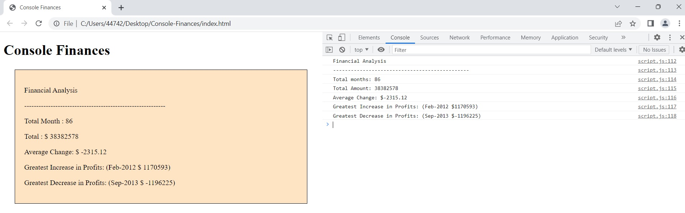

# Console-Finances
Console-Finances

In this project i was tasked to log some finance record values in the console.
Some values i was tasked to log was the total amount of months, total earnings, average change from month to month,greatest month for income and least greatest month for income.

From the image provided above i managed to log the values in the console but also took it one step further and linkd my html to java-script and made the values appear in the html browser.